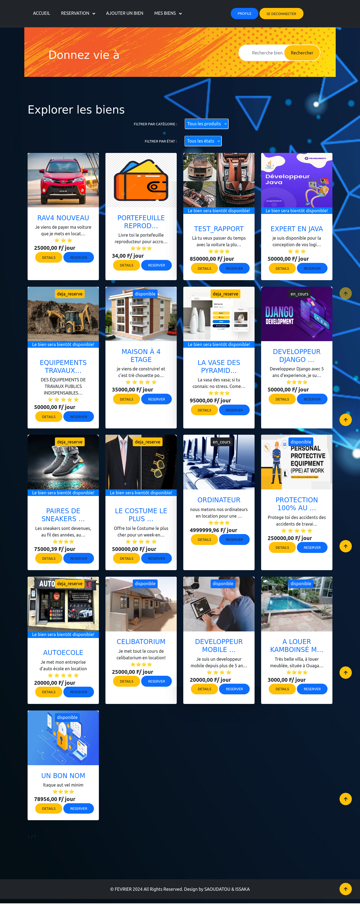

_Groupe C : Project 3_

_Projet 3 : Plateforme de location de biens
Développez une plateforme permettant aux utilisateurs de mettre en location des biens
(voitures, logements, équipements, etc.), de gérer les réservations, les paiements et les avis
des utilisateurs._

#### DERA SAOUDATOU
#### OUEDRAOGO W.ISSAKA

